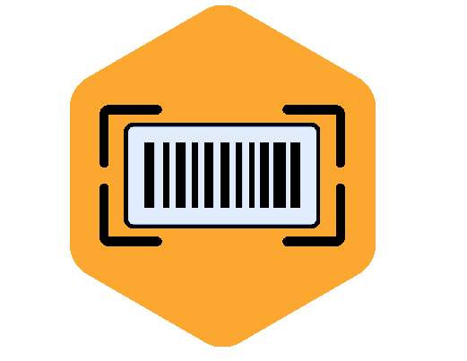
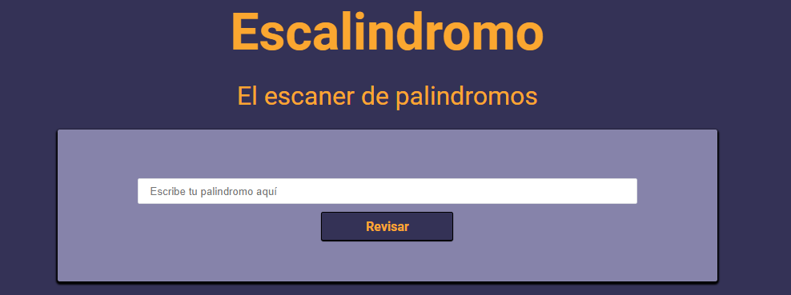
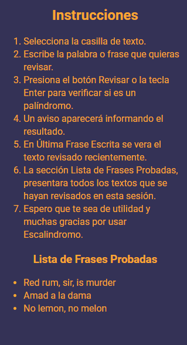

<h1 align="center">
  
   Escalindromo 
</h1>

The palindrome scanner

Escalindomo is a tool for scan and search panlindromes in words or complete phrases, including a history section to know how much tries have you done.

## Table of Contents
- [Steps to Collaborate](#steps-to-collaborate)
- [Components](#components)
- [License](#license)

## Steps to Collaborate
1. Fork the project: by clicking the fork button (located at the top right corner)
2. Clone the project on your device: `git clone https://github.com/<your username>/Escalindromo.git`
3. Do the necessary improvements and make a commit: `git commit -am "<commit message>"` or use `git add .` and then `git commit -m "<commit message>"`
4. Upload changes to the repository created with the fork: `git push origin <branch name>`
5. Create a pull request to the original project.

## Components
### Scanner

	

### Last Word/Phrase

	

###	Instructions and History 

	

## License
[MIT License](https://github.com/Ulzahk/Escalindromo/blob/master/LICENSE)
